  

  

    <strong>Building reliable backend systems with clear APIs, maintainable architecture, and predictable operations.</strong>
  

  

    
    
    
    
  

---

## About

- Backend developer focused on reliable services and clean API boundaries.
- Interested in distributed systems, automation, observability, and agent-based workflows.
- I value simple designs that are easy to operate, test, and evolve.

## Core Strengths

| Area | Focus |
| --- | --- |
| Backend | API design, service architecture, async workflows |
| Data | MySQL schema design, Redis caching, query optimization |
| Platform | Dockerized services, Kubernetes deployment, operational reliability |
| AI / Agents | LangGraph-based workflows and backend integration |

## Tech Stack

  
  
  
  
  
  
  
  
  

## GitHub Activity

  
  

   

  

## Problem Solving

  

---

  

